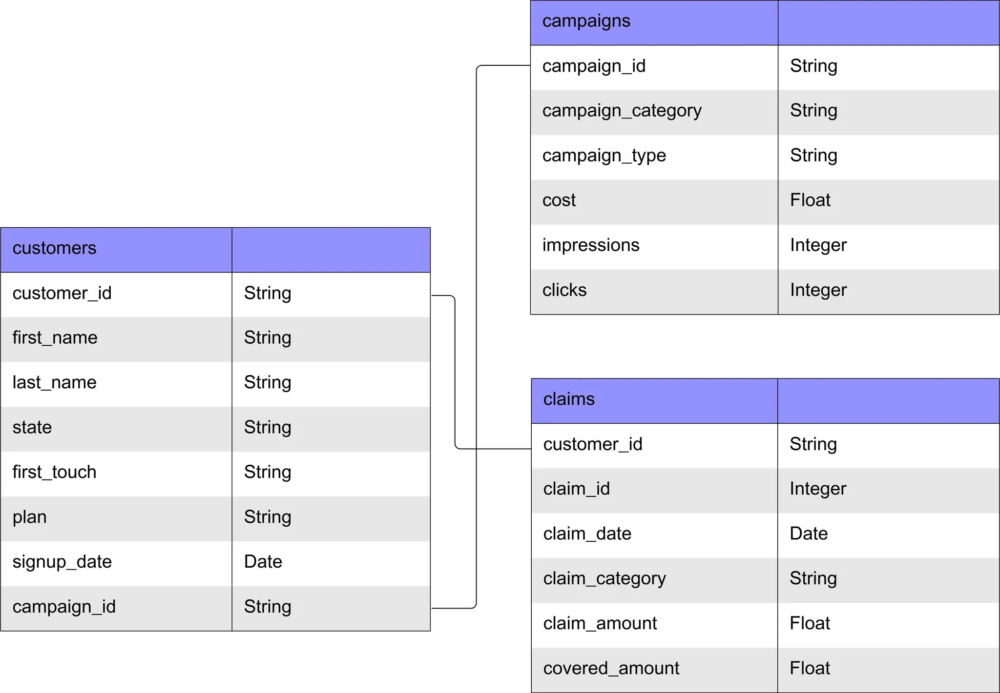

<h1 align="center">
   
</h1>

# Pathway Health Campaign Insights

## Overview

The goal of this project was to evaluate the performance of Pathway Health’s marketing campaigns from 2019 to 2023 in order to inform 2024 marketing budget allocation.

Founded in 2016, Pathway Health is a medical insurance company serving thousands of clients across the United States and offering Bronze, Silver, Gold, and Platinum plans with varying premiums and coverage levels. In 2019, the company launched new marketing campaigns spanning topics such as health awareness and tips, affordable health plans, and preventive care.

As Pathway Health prepares its 2024 marketing strategy, leadership sought a deeper understanding of how campaign categories performed across the marketing funnel from impressions and clicks to signups and downstream claim costs since 2019. The budget must balance three objectives:
1. **Increase brand awareness**  
2. **Increase customer signups**  
3. **Manage claim risk**

 

## Dataset Structure

The dataset covered the period 2019–2023 and included three main tables:
- **Campaigns**: campaign category, type, impressions, clicks, spend  
- **Customers**: signups, plan tier, state, campaign attribution  
- **Claims**: claim amount, claim type, claim date

These tables were integrated into a Tableau dashboard to enable self‑service exploration and quarterly business reviews.

 

## North Star Metrics

The analysis was anchored on three strategic metrics:

| Objective              | Metric(s)                  | Definition |
|------------------------|----------------------------|------------|
| **Increase Awareness** | Click‑Through Rate (CTR)   | % of impressions that resulted in a click |
| **Increase Signups**   | Signups & Cost per Signup (CPS) | Volume of new customers and efficiency of acquisition |
| **Manage Claim Risk**  | Claim Amount   | Total and average cost of filed claims |

Supporting metrics included impressions, clicks, signup rate, and cost per click (CPC).

 

## Insights Summary

#### Brand Awareness & Acquisition
- **Health For All** campaigns led across CTR, signup rate, and CPS, driven by strong Health Awareness campaigns.
- **#CoverageMatters** and **#HealthyLiving** combined high signup volume with low CPS, making them efficient acquisition channels.
- **Golden Years Security** underperformed severely, with minimal signups and the highest CPS.

#### Claim Risk
- **Compare Health Coverage** delivered signups but generated the highest **per‑claim costs**, suggesting disproportionate downstream risk.

#### Funnel Quality
- Several campaigns showed breakdowns (e.g., high CTR but no signups, missing click data, 0‑click signups).
- Signups were heavily concentrated in **New Jersey (~50%)**, limiting generalizability of results.

 

## Recommendations

- **Reallocate budget** toward efficient campaigns (Health For All, #CoverageMatters).
- **Reduce or eliminate spend** on underperformers (Golden Years Security, Compare Health Coverage).
- **Investigate anomalies** in click/signup attribution and NJ concentration.
- **Improve data capture**: campaign start/end dates, channel and billing model (CPC vs CPM), and geographic detail.

 

## Dashboard

A Tableau dashboard was created to support ongoing monitoring of campaign performance. It enables filtering by plan, campaign type, and state, and provides views of:
- Marketing funnel metrics (impressions → clicks → signups)
- Signup and claim trends over time
- Campaign category comparisons across KPIs

 

## Presentation

The final presentation synthesizes insights and recommendations for the marketing team and provides guidance for 2024 budget allocation.

